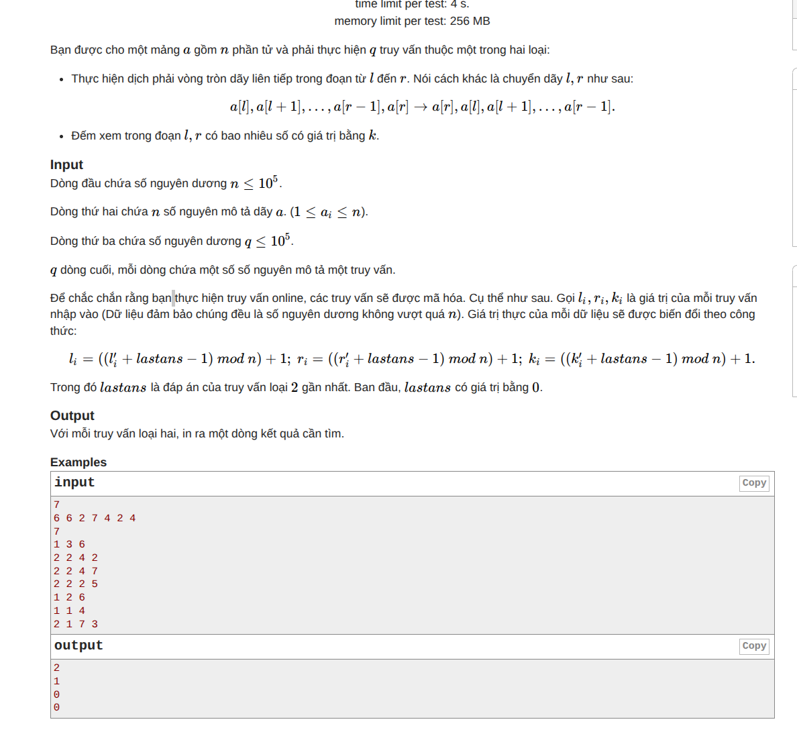

## Tài liệu tham chiếu

- [Đề bài `statement.md`](/khu-vuon-slope-trick/statement.md)
- [Source code `solve.cpp`](/khu-vuon-slope-trick/solve.cpp)



# Câu 3 - Khu vườn

## 1. Ý chính của bài

Đặt:

```text
d[i] = A[i] - B[i]
```

- `d[i] > 0`: bồn `i` dư đất.
- `d[i] < 0`: bồn `i` thiếu đất.

Gọi `f[i]` là lượng đất đi qua cạnh giữa `i` và `i + 1`:

- `f[i] > 0`: chuyển từ trái sang phải.
- `f[i] < 0`: chuyển từ phải sang trái.

Khi đó ở bồn `i`, sau khi nhận/gửi đất qua hai cạnh kề, lượng đất còn dư là:

```text
q[i] = d[i] + f[i - 1] - f[i]
```

- Nếu `q[i] > 0` thì phải bỏ đi `q[i]` đơn vị, tốn `Y * q[i]`.
- Nếu `q[i] < 0` thì phải mua thêm `-q[i]` đơn vị, tốn `X * (-q[i])`.
- Dòng qua cạnh `i` tốn `Z * |f[i]|`.

Vì thế bài toán trở thành tối ưu:

```text
sum(
    Z * abs(f[i])
  + Y * max(q[i], 0)
  + X * max(-q[i], 0)
)
```

Đây là một bài toán quy hoạch động trên đường thẳng với hàm chi phí lồi.

## 2. DP cơ bản

Đặt `F[i](x)` là chi phí nhỏ nhất sau khi xử lý xong các bồn `1..i`, và đang gửi `x` đơn vị đất từ bồn `i` sang `i + 1`.

Khi đó:

```text
F[0](0) = 0
F[0](x) = +inf với x != 0
```

và

```text
F[i](x) =
    Z * abs(x)
    + min_y {
        F[i - 1](y)
        + Y * max(d[i] + y - x, 0)
        + X * max(x - d[i] - y, 0)
    }
```

`F[N](0)` là đáp án.

Nếu làm trực tiếp theo mọi giá trị `x, y` thì quá chậm. Điểm quan trọng là mọi `F[i]` đều là hàm lồi, khúc tuyến tính theo `x`, nên ta không cần lưu toàn bộ bảng DP, chỉ cần lưu "hình dạng" của hàm.

## 3. “Điểm gãy” là gì?

Vì `F[i](x)` là hàm lồi, khúc tuyến tính, đồ thị của nó gồm nhiều đoạn thẳng ghép lại.

“Điểm gãy” chính là các hoành độ mà tại đó độ dốc của hàm thay đổi.

Ví dụ:

```text
|x|
```

- với `x < 0`, độ dốc là `-1`;
- với `x > 0`, độ dốc là `+1`;
- tại `x = 0`, độ dốc đổi, nên `0` là một điểm gãy.

Trong bài này, ta không lưu từng đoạn thẳng, mà lưu danh sách các điểm gãy cùng với độ lớn thay đổi của độ dốc tại mỗi điểm.

Một phần tử `(p, w)` nghĩa là:

- có một điểm gãy tại vị trí `p`;
- khi đi qua điểm đó, độ dốc đổi thêm `w` đơn vị ở phía tương ứng.

Nói ngắn gọn: heap không lưu "một lượng đất", mà lưu cấu trúc hình học của hàm `F[i]`.

## 4. Hai `priority_queue` lưu gì?

Ta biểu diễn một hàm lồi bằng:

- `add`: giá trị nhỏ nhất hiện tại của hàm;
- `shift`: độ tịnh tiến ngang của toàn bộ hàm;
- `L`: các điểm gãy nằm về phía trái vùng đáy;
- `R`: các điểm gãy nằm về phía phải vùng đáy.

Ở đây "vùng đáy" là đoạn mà hàm đạt giá trị nhỏ nhất. Nếu đáy co lại thành một điểm thì đó là nghiệm tối ưu hiện tại.

Trong code hiện tại, `L` và `R` được cài bằng `map` để:

- lấy được breakpoint ngoài cùng ở mỗi phía;
- gộp nhiều breakpoint trùng vị trí thành một phần tử duy nhất.

Nhưng về mặt ý tưởng, chúng vẫn đóng vai trò như hai heap hai phía của vùng đáy.

### Heap trái `L`

`L` lưu các điểm gãy ở bên trái đáy.

Mỗi cặp `(p, w)` trong `L` có nghĩa:

- điểm gãy thật nằm tại `p + shift`;
- nếu đi từ đáy sang bên trái và vượt qua điểm này, độ dốc giảm thêm `w`.

Ta dùng `min-heap` để luôn lấy được điểm xa đáy nhất bên trái trước.

### Heap phải `R`

`R` lưu các điểm gãy ở bên phải đáy.

Mỗi cặp `(p, w)` trong `R` có nghĩa:

- điểm gãy thật nằm tại `p + shift`;
- nếu đi từ đáy sang bên phải và vượt qua điểm này, độ dốc tăng thêm `w`.

Ta dùng `max-heap` để luôn lấy được điểm xa đáy nhất bên phải trước.

### Góc nhìn "mảng hiệu của slope"

Một cách nhìn rất quan trọng là `L` và `R` không lưu trực tiếp giá trị hàm,
mà lưu các "event đổi slope".

- `L` là mảng hiệu cho phần bên trái: tại breakpoint `p`, slope bị giảm thêm `w`
  nếu đi từ đáy sang trái qua điểm đó.
- `R` là mảng hiệu cho phần bên phải: tại breakpoint `p`, slope bị tăng thêm `w`
  nếu đi từ đáy sang phải qua điểm đó.

Vì vậy từ mỗi phần tử `(p, w)` ta có thể khôi phục lại một mảnh hàm cơ bản:

- event trái tạo ra mảnh `w * max(p - x, 0)`;
- event phải tạo ra mảnh `w * max(x - p, 0)`.

Toàn bộ hàm chính là:

```text
giá trị ở đáy
+ tổng các mảnh do L sinh ra
+ tổng các mảnh do R sinh ra
```

Đây là lý do `value_at()` chỉ cần cộng đóng góp của từng event vào một giá trị
đáy đã biết.

Nếu thích liên hệ với "cập nhật đoạn", có thể nhìn như sau:

- thêm `w * max(x - a, 0)` làm slope tăng thêm `w` trên cả nửa trục phải
  `(a, +inf)`;
- thêm `w * max(a - x, 0)` làm slope giảm thêm `w` trên cả nửa trục trái
  `(-inf, a)`.

Vì ta đang lưu **mảng hiệu của slope**, một "cập nhật nửa trục" như thế không
cần sửa mọi điểm trên đoạn. Ta chỉ cần thêm một event tại điểm bắt đầu thay đổi
độ dốc:

- event phải tại `a` cho `w * max(x - a, 0)`;
- event trái tại `a` cho `w * max(a - x, 0)`.

Đây là cầu nối trực tiếp từ công thức toán học sang hai hàm
`add_x_minus_a()` và `add_a_minus_x()` trong code.

### Vì sao cần `w`?

Độ dốc không chỉ thay đổi `1` đơn vị mỗi lần. Nó có thể nhảy một lượng lớn như `X`, `Y`, `Z`.

Vì vậy thay vì đẩy cùng một vị trí vào heap nhiều lần, ta gộp lại thành một cặp `(vị trí, trọng số)`.

Ví dụ:

- `Z * |x|` tạo một điểm gãy tại `0`;
- bên trái độ dốc giảm `Z`;
- bên phải độ dốc tăng `Z`.

Nên ta thêm trọng số `Z` vào cả `L` lẫn `R` tại vị trí `0`.

## 5. Ba thao tác mỗi bước

Từ công thức DP, khi xử lý bồn `i`, ta làm 3 việc.

### 5.1. Dịch theo `d[i]`

Đặt:

```text
K_i(x) =
    min_y {
        F[i - 1](y)
        + Y * max(d[i] + y - x, 0)
        + X * max(x - d[i] - y, 0)
    }
```

thì:

```text
F[i](x) = K_i(x) + Z * |x|
```

Phần `d[i]` chỉ xuất hiện trong tổ hợp `x - d[i]`. Nói cách khác,
`K_i` có cùng hình dạng với hàm thu được khi `d[i] = 0`, chỉ bị dời ngang
thêm `d[i]`.

Viết chặt hơn, nếu đặt:

```text
H_i(t) =
    min_y {
        F[i - 1](y)
        + Y * max(y - t, 0)
        + X * max(t - y, 0)
    }
```

thì chỉ cần thay:

```text
t = x - d[i]
```

là được:

```text
K_i(x) = H_i(x - d[i])
```

Nghĩa là đồ thị của `K_i` chính là đồ thị của `H_i` bị tịnh tiến sang phải
`d[i]` đơn vị.

Trực giác:

- `d[i] > 0`: bồn `i` đang dư đất, nên trạng thái tối ưu có xu hướng đẩy
  dòng sang phải nhiều hơn;
- `d[i] < 0`: bồn `i` đang thiếu đất, nên đáy bị kéo sang trái.

Vì vậy toàn bộ breakpoint của hàm chỉ bị tịnh tiến ngang.

Ta không sửa từng phần tử trong heap, chỉ cần:

```text
shift += d[i]
```

Nếu sau khi xử lý xong các bồn `1..i` ta đang có biến `shift`, thì thực chất:

```text
shift = d[1] + d[2] + ... + d[i]
```

theo đúng nghĩa "tổng độ dời ngang" đã cộng dồn qua từng bước.

Điểm mấu chốt là `shift` không phải một hằng số xuất hiện ngẫu nhiên trong code,
mà đến trực tiếp từ công thức:

```text
K_i(x) = H_i(x - d[i])
```

Mỗi lần có thêm một bồn mới, biến đầu vào của hàm trước đó bị thay từ `x` thành
`x - d[i]`, tức toàn bộ breakpoint phải dời ngang thêm `d[i]`. Vì code không
muốn sửa từng breakpoint một, nên nó giữ nguyên các khóa thô trong `map` và chỉ
cập nhật hệ quy chiếu qua biến `shift`.

Do đó các khóa đang lưu trong `L`, `R` chỉ là tọa độ thô. Nếu một breakpoint
được lưu với khóa `p`, thì vị trí thật của nó trên trục `x` là:

```text
p + shift
```

Ngược lại, khi muốn thêm một breakpoint thật ở vị trí `a`, ta chỉ cần lưu:

```text
a - shift
```

vào `L` hoặc `R`, nên toàn bộ thao tác dịch ngang chỉ tốn `O(1)`.

Nên thao tác này là `O(1)`.

### 5.2. Kẹp độ dốc vào đoạn `[-Y, X]`

Xét riêng phần chưa cộng chi phí vận chuyển:

```text
K_i(x) =
    min_y {
        F[i - 1](y)
        + Y * max(d[i] + y - x, 0)
        + X * max(x - d[i] - y, 0)
    }
```

Ta sẽ thấy ngay rằng mọi slope của `K_i` luôn nằm trong đoạn `[-Y, X]`.

#### Nhìn từ nhánh trái

Nếu với một giá trị `x` nào đó, nghiệm tối ưu `y` rơi vào nhánh:

```text
y >= x - d[i]
```

thì:

```text
d[i] + y - x >= 0
```

và phần chi phí tại bồn `i` trở thành:

```text
Y * (d[i] + y - x) = -Y * x + Y * y + Y * d[i]
```

Lúc đó, với `y` đang được cố định, biểu thức theo `x` chỉ là một đường thẳng
có slope bằng `-Y`.

Nói cách khác, trên nhánh này ta có:

```text
K_i(x) = -Y * x + C
```

với `C` là một hằng số phụ thuộc vào `y`.

#### Nhìn từ nhánh phải

Tương tự, nếu nghiệm tối ưu `y` rơi vào:

```text
y <= x - d[i]
```

thì:

```text
x - d[i] - y >= 0
```

và chi phí tại bồn `i` trở thành:

```text
X * (x - d[i] - y) = X * x - X * y - X * d[i]
```

nên khi `y` cố định, biểu thức theo `x` là một đường thẳng có slope bằng `X`.

#### Kết luận về slope

`K_i(x)` là `min` của rất nhiều đường thẳng như trên:

- một số đường có slope `-Y`;
- một số đường có slope `X`;
- và khi `x` thay đổi, nghiệm tối ưu có thể chuyển từ đường này sang đường
  khác.

Vì `K_i` là hàm lồi, khi đổi từ một đường tối ưu sang đường tối ưu khác, slope
chỉ có thể tăng dần. Do các đường ứng viên chỉ mang hai slope biên `-Y` và `X`,
mọi slope thực tế của `K_i` bắt buộc phải nằm trong đoạn:

```text
[-Y, X]
```

Đây chính là ý nghĩa của bước "kẹp độ dốc":

- bên trái không được dốc nhỏ hơn `-Y`;
- bên phải không được dốc lớn hơn `X`.

Do đó:

- nếu tổng trọng số trong `L` vượt `Y`, ta bỏ bớt các điểm gãy xa nhất bên trái;
- nếu tổng trọng số trong `R` vượt `X`, ta bỏ bớt các điểm gãy xa nhất bên phải.

Đây là lý do phải dùng `priority_queue`: luôn loại được phần đuôi ngoài cùng trước.

### 5.3. Cộng `Z * |x|`

Hàm này thêm đúng một điểm gãy tại `x = 0`:

- bên trái giảm thêm `Z`;
- bên phải tăng thêm `Z`.

Vì đang dùng tọa độ thô, điểm `0` thật được lưu thành:

```text
(-shift, Z)
```

trong cả `L` và `R`.

### 5.4. Ghi chú về thao tác rebalance

Trước hết, hãy viết hai phép thêm theo đúng ngôn ngữ "update đoạn trên mảng hiệu
của slope".

#### `add_x_minus_a(a, w)` là update gì?

Ta thêm:

```text
w * max(x - a, 0)
```

Hàm này có slope:

- bằng `0` khi `x < a`;
- bằng `w` khi `x > a`.

Vậy nó làm **slope của toàn hàm tăng thêm `w` trên đoạn `(a, +inf)`**.

Nếu chỉ nhìn dưới dạng mảng hiệu, đây là một cập nhật rất đơn giản:

```text
thêm một event phải trọng số w tại a
```

Tức là trong code, nếu không vướng vùng đáy, ta chỉ cần thực hiện:

```text
right_breaks[a] += w
```

#### `add_a_minus_x(a, w)` là update gì?

Tương tự, ta thêm:

```text
w * max(a - x, 0)
```

Hàm này có slope:

- bằng `-w` khi `x < a`;
- bằng `0` khi `x > a`.

Vậy nó làm **slope của toàn hàm giảm thêm `w` trên đoạn `(-inf, a)`**.

Nếu chỉ nhìn như mảng hiệu, đây là:

```text
thêm một event trái trọng số w tại a
```

tức là trong code, nếu không vướng vùng đáy, ta chỉ cần:

```text
left_breaks[a] += w
```

#### Vì sao không phải lúc nào cũng chỉ việc cộng event?

Nếu `a` nằm sai phía so với đáy hiện tại, thì "cập nhật nửa trục" ở trên sẽ làm
đáy của hàm dịch chuyển. Khi đó, ngoài việc thêm event mới, ta còn phải:

- lấy bớt một phần trọng số ở breakpoint sát đáy phía đối diện;
- chuyển phần trọng số đó sang phía còn lại;
- cộng phần tăng bắt buộc của giá trị nhỏ nhất vào `min_value`.

Đó chính là phần `while` trong `add_x_minus_a()` và `add_a_minus_x()`: nó không
phải cập nhật giá trị hàm theo từng `x`, mà đang thực hiện **rebalance sau một
cập nhật đoạn trên mảng hiệu slope**.

Khi cài đặt bằng slope trick, hai phép thêm cơ bản không cập nhật từng đoạn
thẳng của đồ thị, mà chỉ thêm một event đổi slope rồi rebalance ở biên đáy.

Ví dụ với mảnh phải `max(x - a, 0)`, nếu `a` nằm bên trái breakpoint gần đáy
nhất ở phía trái là `l`, ta dùng đẳng thức:

```text
max(l - x, 0) + max(x - a, 0)
= (l - a) + max(x - l, 0) + max(a - x, 0)
```

Ý nghĩa:

- `l - a` là phần tăng bắt buộc của giá trị nhỏ nhất, nên ta cộng ngay vào
  `min_value`;
- breakpoint ở `l` được chuyển sang phía phải;
- đồng thời thêm một breakpoint mới ở `a` cho phía trái.

Điều quan trọng là: breakpoint được chuyển cuối cùng trong quá trình này chỉ là
một biên của đoạn đáy mới do phần trọng số vừa rebalance tạo ra. Nó không nhất
thiết luôn là toàn bộ biên của đáy của cả hàm, vì các breakpoint khác vẫn có
thể đang giữ đáy rộng hơn.

Phép `add_a_minus_x` hoàn toàn đối xứng:

```text
max(x - r, 0) + max(a - x, 0)
= (a - r) + max(r - x, 0) + max(x - a, 0)
```

với `r` là breakpoint gần đáy nhất ở phía phải.

Nếu đối chiếu trực tiếp với code:

- ở `add_x_minus_a()`, câu lệnh thêm vào `right_breaks` là phần "cập nhật đoạn
  `(a, +inf)`" dưới dạng mảng hiệu;
- ở `add_a_minus_x()`, câu lệnh thêm vào `left_breaks` là phần "cập nhật đoạn
  `(-inf, a)`" dưới dạng mảng hiệu;
- toàn bộ phần còn lại trong vòng `while` là logic rebalance để bảo toàn việc
  `left_breaks`, `right_breaks` vẫn đang mô tả đúng một hàm lồi với vùng đáy
  hợp lệ.

## 6. Khởi tạo

Hàm cơ sở sau bước đầu tiên tương ứng với:

```text
g(x) = Y * max(-x, 0) + X * max(x, 0)
```

Nó có một điểm gãy tại `0`:

- phía trái có độ dốc `-Y`;
- phía phải có độ dốc `X`.

Vì vậy trạng thái ban đầu có thể hiểu là:

```text
add = 0
shift = 0
L = {(0, Y)}
R = {(0, X)}
```

## 7. Lấy đáp án cuối

Sau khi xử lý hết `N` bồn, ta cần giá trị `F[N](0)`.

Lúc này `add` mới chỉ là giá trị nhỏ nhất của hàm, chưa chắc nằm ở `x = 0`.
Trong code, biến đó tên là `min_value`.

Điều quan trọng là `L` và `R` đang lưu "mảng hiệu của slope", nên để tính
giá trị tại một điểm `x` ta chỉ cần cộng tất cả các đóng góp của các event
đổi slope vào `min_value`.

Hiểu theo ngôn ngữ "tích phân lại mảng hiệu":

- `L`, `R` cho ta biết slope đổi ở đâu và đổi bao nhiêu;
- `min_value` cho ta biết mốc giá trị tại đáy;
- từ đó, muốn biết giá trị tại `x`, ta chỉ cần cộng tất cả phần diện tích do
  các lần đổi slope tạo ra trên đường đi từ đáy tới `x`.

Vì trong cấu trúc dữ liệu ta lưu tọa độ thô, trước hết đổi:

```text
raw_x = x - shift
```

Khi đó:

- mỗi phần tử `(p, w)` trong `L` đóng góp:

```text
w * max(p - raw_x, 0)
```

  vì nếu `raw_x < p` thì ta đang đứng về bên trái breakpoint đó, nên event này
  kéo giá trị hàm tăng thêm đúng `w` nhân với khoảng cách `p - raw_x`;

- mỗi phần tử `(p, w)` trong `R` đóng góp:

```text
w * max(raw_x - p, 0)
```

  vì nếu `raw_x > p` thì ta đang đứng về bên phải breakpoint đó, nên event này
  kéo giá trị hàm tăng thêm đúng `w` nhân với khoảng cách `raw_x - p`.

Vì thế:

```text
F[N](x)
= min_value
+ sum_{(p,w) in L} w * max(p - raw_x, 0)
+ sum_{(p,w) in R} w * max(raw_x - p, 0)
```

Đây chính là điều `value_at()` làm.

Có thể hiểu trực giác hơn như sau:

- `min_value` là giá trị ở đáy;
- mỗi event trong `L`, `R` là một phần tử của "mảng hiệu slope", tức nói rằng
  khi ta đi qua một breakpoint thì slope đổi thêm `w`;
- cộng các biểu thức `max(...)` ở trên chính là "tích phân lại" các thay đổi
  slope đó để thu được chênh lệch giá trị từ đáy tới điểm `x`.

Độ phức tạp:

- mỗi lần thêm/xóa trên heap là `O(log N)`;
- tổng số phần tử được thêm là `O(N)`;
- nên toàn bộ thuật toán là `O(N log N)`;
- bộ nhớ `O(N)`.

## 8. Tóm tắt ngắn

- `F[i](x)` là chi phí tốt nhất nếu sau bồn `i` còn gửi `x` đất sang phải.
- `F[i]` là hàm lồi, khúc tuyến tính.
- Ta không lưu cả hàm theo từng `x`, mà lưu các điểm gãy của nó.
- `L` chứa các điểm gãy bên trái đáy, `R` chứa các điểm gãy bên phải đáy.
- Mỗi phần tử heap là `(vị trí, trọng số thay đổi độ dốc)`.
- Mỗi bồn mới chỉ làm 3 việc: dịch hàm, kẹp độ dốc, thêm `Z * |x|`.

Đó là ý nghĩa chính của hai `priority_queue` và các “điểm gãy” được lưu trong lời giải này.
